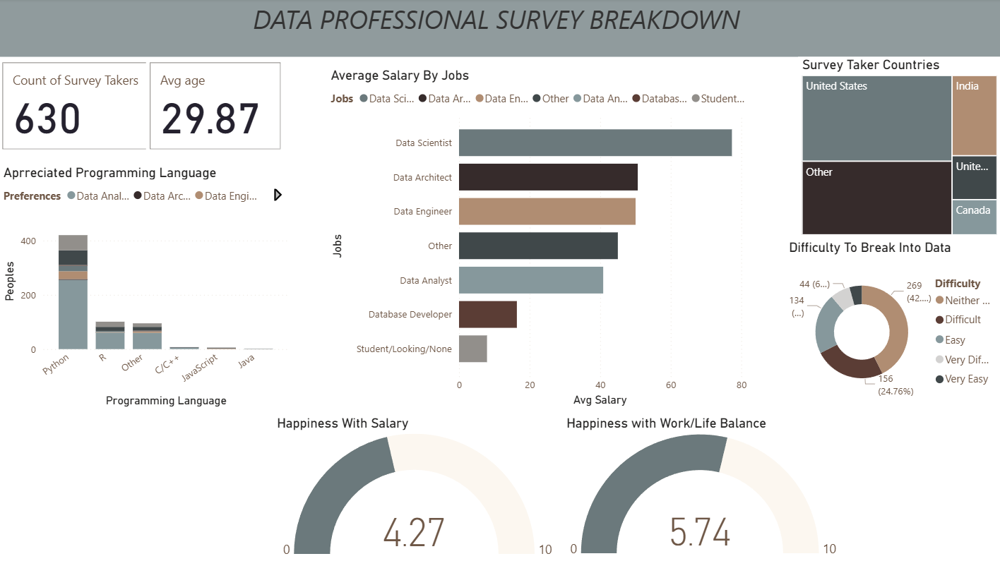

# 📊 Data Professional Survey Analysis | Power BI Dashboard

## Overview

An interactive Power BI dashboard built to analyze survey data from data professionals worldwide. The report highlights key insights such as salary trends, job roles, programming language preferences, work-life balance, and difficulty in breaking into the data field.

This project demonstrates end-to-end data analytics skills including data cleaning, modeling, visualization, and business insight generation.

## Tech Stack

* 📊 **Power BI Desktop** – Dashboard creation & interactive reporting
* 🔄 **Power Query** – Data cleaning & transformation
* 🧠 **DAX** – Calculated measures & KPIs
* 🗄 **Data Modeling** – Relationships for cross-filtering
* 🐍 **Python (Pandas – Conceptual knowledge applied)**
* 🧮 **SQL (Data understanding & aggregation concepts)**

## Data Source

This project uses a publicly available Data Professional Survey dataset sourced from Kaggle.

The dataset contains survey responses from data professionals worldwide, including:

* Job roles
* Average salary
* Country distribution
* Programming language preferences
* Job satisfaction & work-life balance ratings
* Difficulty in entering the data industry

The data was cleaned, transformed, and structured using Power BI Query Editor (Power Query) to handle missing values, inconsistencies, and formatting issues before building the data model and dashboard.

## Features & Insights

### 🔎 Business Problem

There is limited visibility into salary trends, skill preferences, and career entry challenges in the data industry. Raw survey data makes it difficult to quickly extract actionable insights.

### 🎯 Goal of the Dashboard

To build a clear and interactive report that:

* Analyzes salary distribution across job roles
* Identifies popular programming languages
* Evaluates job satisfaction & work-life balance
* Examines industry entry difficulty

### 📌 Key Visuals

* **KPI Cards** – Total survey count (630), Average age (29.87)
* **Average Salary by Job Role** – Data Scientist, Data Engineer, Data Analyst, etc.
* **Programming Language Preferences** – Python, R, C/C++, JavaScript
* **Country Distribution (Treemap)** – Respondent location insights
* **Difficulty to Break into Data (Donut Chart)**
* **Happiness with Salary & Work-Life Balance (Gauge Charts)**

### 💡 Key Insights

* Data Scientists report the highest average salary.
* Python is the most preferred programming language.
* A significant portion of respondents find breaking into data “Difficult.”
* Work-life balance ratings are relatively strong compared to salary satisfaction.
  

## Business Impact

* Helps aspiring professionals understand market expectations.
* Provides salary benchmarking across roles.
* Supports career planning based on skill demand.
* Demonstrates an end-to-end analytics workflow from raw data preparation to insight-driven decision support.
  

# 📊 Dashboard Preview
    
